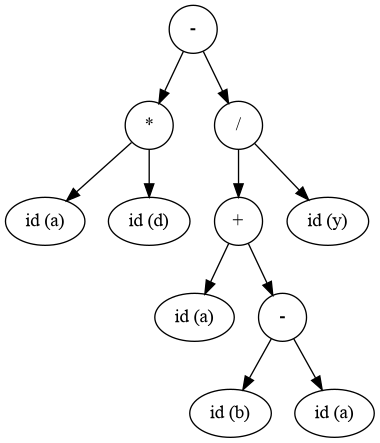

# LR Parser

## Задача

Реализовать синтаксический анализ простого арифметического языка. Операции языка: сложение, вычитание, умножение, деление, скобки. Терминалами будут являться `+`, `-`, `*`, `/`, `(`, `)`.

## Описание решения

Реализация представляет из себя конечный автомат LR(0), где L - парсинг слева направо, R - правое порождение, 0 - отсутствие предпросмотра символов. Для разрешения конфликтов используется SLR(1), использующий предпросмотр на 1 символ для принятия решений.

## Грамматика

```math
\begin{flalign*}
E &\Rightarrow E + T | E - T | T \\
T &\Rightarrow T * F | T / F | F \\
F &\Rightarrow (E) | \text{id} 
\end{flalign*}
```
[Подробное построение LR-парсера](docs/lr-parser.md)

## Запуск

Зависимости:
```shell
sudo apt-get install -y build-essential cmake flex libfl-dev graphviz graphviz-dev libgtest-dev
```

Сборка:
```shell
cmake -S . -B build -DCMAKE_BUILD_TYPE=Release
cmake --build build
```

Запуск:
```shell
./build/lr-parser < end2end/tests/test1.txt 
```

Построенное AST-дерево в `.png` формате можно найти в папке `output` после запуска. 

<details>
<summary>Примеры</summary>

Пример парсинга выражения `a * d - (a + (b - a)) / y`:
```shell
Parsing expression: a * d - (a + (b - a)) / y
------------------------------------------------------------------------------------------------------------
| State | Stack                          | Input                          | Action                         |
------------------------------------------------------------------------------------------------------------
| I0    |                                | a * d - (a + (b - a)) / y$     | Shift -> I5                    | 
| I5    | id                             | * d - (a + (b - a)) / y$       | Reduce 8: F -> id              | 
| I3    | F                              | * d - (a + (b - a)) / y$       | Reduce 6: T -> F               | 
| I2    | T                              | * d - (a + (b - a)) / y$       | Shift -> I8                    | 
| I8    | T *                            | d - (a + (b - a)) / y$         | Shift -> I5                    | 
| I5    | T * id                         | - (a + (b - a)) / y$           | Reduce 8: F -> id              | 
| I13   | T * F                          | - (a + (b - a)) / y$           | Reduce 4: T -> T * F           | 
| I2    | T                              | - (a + (b - a)) / y$           | Reduce 3: E -> T               | 
| I1    | E                              | - (a + (b - a)) / y$           | Shift -> I7                    | 
| I7    | E -                            | (a + (b - a)) / y$             | Shift -> I4                    | 
| I4    | E - (                          | a + (b - a)) / y$              | Shift -> I5                    | 
| I5    | E - ( id                       | + (b - a)) / y$                | Reduce 8: F -> id              | 
| I3    | E - ( F                        | + (b - a)) / y$                | Reduce 6: T -> F               | 
| I2    | E - ( T                        | + (b - a)) / y$                | Reduce 3: E -> T               | 
| I10   | E - ( E                        | + (b - a)) / y$                | Shift -> I6                    | 
| I6    | E - ( E +                      | (b - a)) / y$                  | Shift -> I4                    | 
| I4    | E - ( E + (                    | b - a)) / y$                   | Shift -> I5                    | 
| I5    | E - ( E + ( id                 | - a)) / y$                     | Reduce 8: F -> id              | 
| I3    | E - ( E + ( F                  | - a)) / y$                     | Reduce 6: T -> F               | 
| I2    | E - ( E + ( T                  | - a)) / y$                     | Reduce 3: E -> T               | 
| I10   | E - ( E + ( E                  | - a)) / y$                     | Shift -> I7                    | 
| I7    | E - ( E + ( E -                | a)) / y$                       | Shift -> I5                    | 
| I5    | E - ( E + ( E - id             | )) / y$                        | Reduce 8: F -> id              | 
| I3    | E - ( E + ( E - F              | )) / y$                        | Reduce 6: T -> F               | 
| I12   | E - ( E + ( E - T              | )) / y$                        | Reduce 2: E -> E - T           | 
| I10   | E - ( E + ( E                  | )) / y$                        | Shift -> I15                   | 
| I15   | E - ( E + ( E )                | ) / y$                         | Reduce 7: F -> (E)             | 
| I3    | E - ( E + F                    | ) / y$                         | Reduce 6: T -> F               | 
| I11   | E - ( E + T                    | ) / y$                         | Reduce 1: E -> E + T           | 
| I10   | E - ( E                        | ) / y$                         | Shift -> I15                   | 
| I15   | E - ( E )                      | / y$                           | Reduce 7: F -> (E)             | 
| I3    | E - F                          | / y$                           | Reduce 6: T -> F               | 
| I12   | E - T                          | / y$                           | Shift -> I9                    | 
| I9    | E - T /                        | y$                             | Shift -> I5                    | 
| I5    | E - T / id                     | $                              | Reduce 8: F -> id              | 
| I14   | E - T / F                      | $                              | Reduce 5: T -> T / F           | 
| I12   | E - T                          | $                              | Reduce 2: E -> E - T           | 
| I1    | E                              | $                              | Accept                         | 
------------------------------------------------------------------------------------------------------------
```

Пример AST-дерева:



</details>
